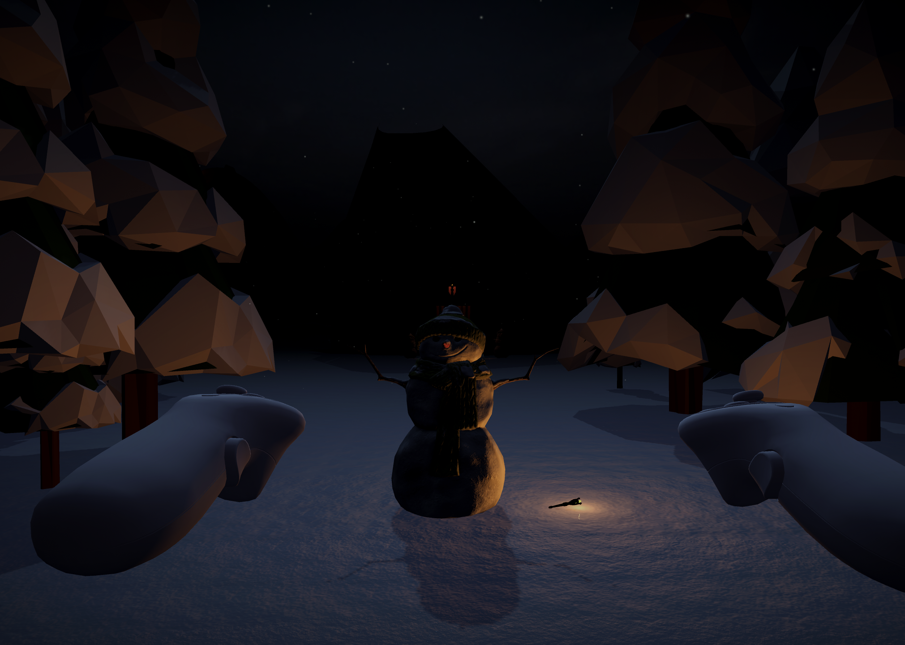

# Tiny-Winter-Scare-VR
A small VR jump scare game for Meta Quest, developed as part of the VR/AR module at my university.
-> Not finished!

<div style="display: flex; gap: 10px;">
  
  
  
</div>

## 🇬🇧 English

### 📋 Project Description

This is a Unity VR project developed on **Linux** using the OpenXR plugin and the Meta XR SDK.
It runs on **all Meta Quest devices** (Quest 1, 2, Pro, and 3).
No Meta/Facebook account is required – only **Developer Mode** needs to be enabled.

---

### 🔧 Requirements

* Meta Quest device with Developer Mode enabled
* ADB or SideQuest to install the APK

---

### ▶️ Installation

1. **Enable Developer Mode** 
   👉 [How to Enable Developer Mode](https://developer.oculus.com/documentation/quest/latest/concepts/mobile-device-setup/)

2. **Download the APK**  👉 [See APK Download](https://github.com/JT-808/Tiny-Winter-Scare-VR/releases)

3. **Install the APK**  
   - Use **ADB** or **SideQuest** to install the APK:
     - **ADB Method:**
       - Connect the Meta Quest to your computer and run the following command in the terminal:
         ```bash
         adb install path/to/your.apk
         ```
     - **SideQuest Method:**
       - Alternatively, use **SideQuest** to install the APK via its user interface.

4. **Launch the Game**  
   - Put on your headset and navigate to **Library** > **Unknown Sources** to find and launch the game.

---
### ⚠️ Disclaimer
This VR experience contains sudden loud sounds and visual jump scares that may not be suitable for all players. Not recommended for individuals with heart conditions, epilepsy, or those sensitive to intense or frightening content. Use at your own risk. The developer is not responsible for any discomfort, fear responses, or health issues that may occur while playing.

---


## 🇩🇪 Deutsch

### 📋 Projektbeschreibung

Dies ist ein Unity-VR-Projekt, das unter **Linux** mit dem OpenXR-Plugin und dem Meta XR SDK entwickelt wurde.
Es läuft auf **allen Meta Quest Geräten** (Quest 1, 2, Pro und 3).
Ein Meta- oder Facebook-Konto ist **nicht erforderlich** – nur der **Entwicklermodus** muss aktiviert sein.

---

### 🔧 Voraussetzungen

* Meta Quest Gerät mit aktiviertem Entwicklermodus
* ADB oder SideQuest zur Installation der APK

---

### ▶️ Installation

1. **Entwicklermodus aktivieren**  
   👉 [Entwicklermodus aktivieren - Oculus Dokumentation](https://developer.oculus.com/documentation/quest/latest/concepts/mobile-device-setup/)

2. **APK herunterladen**  👉 [Siehe APK Download](https://github.com/JT-808/Tiny-Winter-Scare-VR/releases)

3. **APK installieren**  
   - Verwende **ADB** oder **SideQuest**, um die APK zu installieren:
     - **ADB-Methode:**
       - Verbinde die Meta Quest mit deinem Computer und führe den folgenden Befehl im Terminal aus:
         ```bash
         adb install pfad/zur/deiner.apk
         ```
     - **SideQuest-Methode:**
       - Alternativ kannst du **SideQuest** verwenden, um die APK über die Benutzeroberfläche zu installieren.

4. **Spiel starten**  
   - Setze das Headset auf und gehe zu **Bibliothek** > **Unbekannte Quellen**, um das Spiel zu finden und zu starten.

   ---

  ### ⚠️ Haftungsausschluss
Diese VR-Erfahrung enthält plötzliche laute Geräusche und visuelle Schockmomente (Jump Scares), die nicht für alle Spieler geeignet sind. Nicht empfohlen für Personen mit Herzproblemen, Epilepsie oder einer Empfindlichkeit gegenüber intensiven oder gruseligen Inhalten. Die Nutzung erfolgt auf eigene Verantwortung. Der Entwickler übernimmt keine Haftung für Unwohlsein, Angstreaktionen oder gesundheitliche Probleme, die beim Spielen auftreten könnten.
